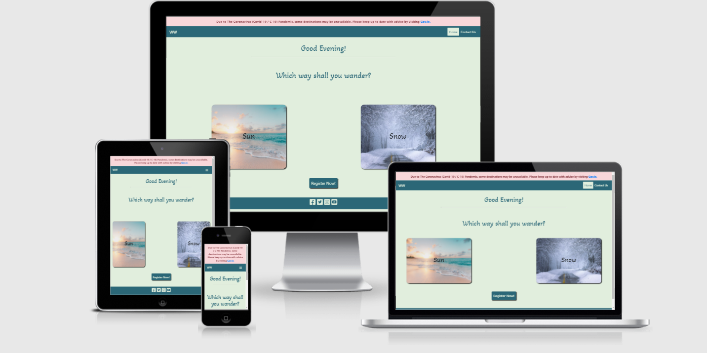
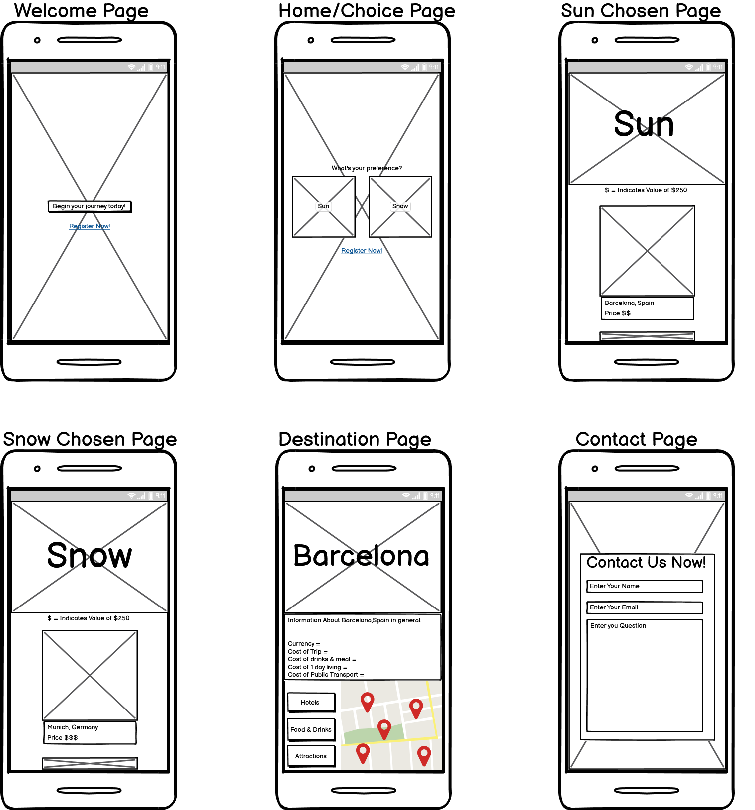
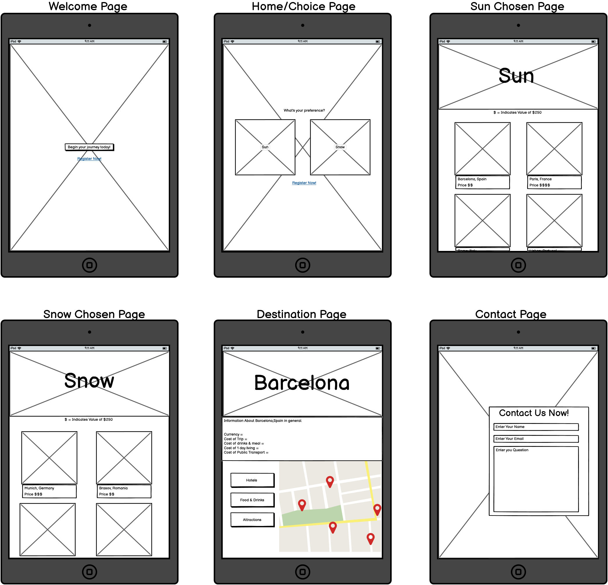
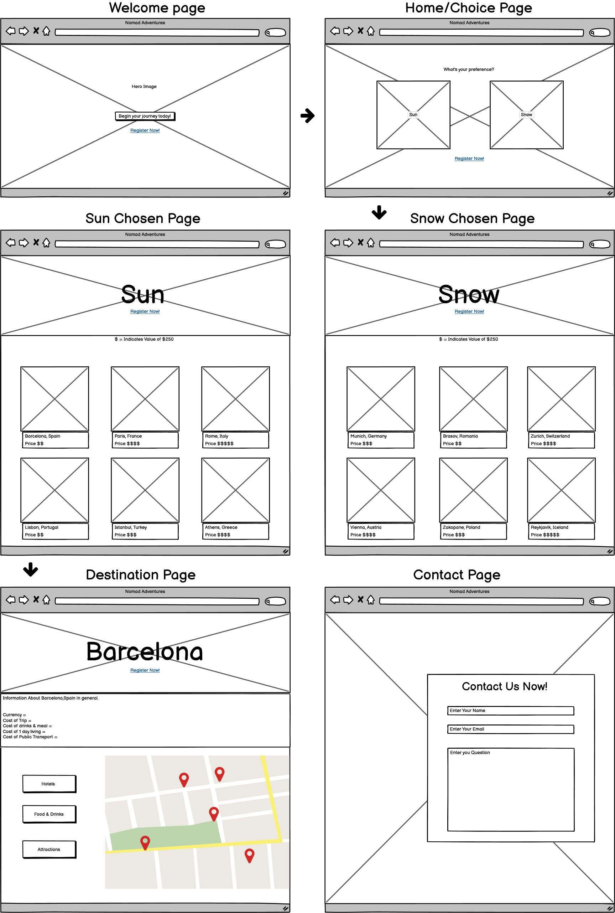

# Wanderers Way

### Travel Planner 

A website designed to provide user's with a choice of avaiable travel locations in an easy to use and new format.
It features a register button on the **Welcome Page** to allow users to bypass all information on the site instantly to sign up.
It also features a choice on the **Home Page** to allow users to choose either a sun holiday or snow holiday which is a search feature that will narrow the field based on the users interest.
By clicking either **Sun** or **Snow** the user can bypass any locations that are immediatley not of interest.
Upon choosing the climate of choice the user is presented with various locations to choose from in that given climate.
After choosing a destination, a page containing some useful travel information as well as a **Google map** showing locations of interest (Hotels, Food & Drinks and Attractions) is displayed.
The **Google maps** area will be interactive and allow a user to view the location of a recommended hotel, thing to do or food and drinks venue.

#### Business Goals
  - To increase traffic to the site and in turn increase registration.
  - To provide simple easy sign up process to enable users to register.
  - To provide simple yet comprehensive information on what to expect from the destinations.
  - To be visually striking enough to catch attention and provoke curiosity to explore the page.
  - To potentially encourage advertisers to place their ads on the page for destinations thus opening up more opportunities for more destinations, offers and expansion of the site.
  - To build awareness of the brand and to allow easy booking.
  - Get users to choose a travel package from this site and/or from its sponsors.

#### Customer Goals
  - To find the best holiday destination for their needs.
  - To be able to find any information they may need.
  - To see benefits to signing up for such a site.

# UX

 #### Potential Customers
  - Mainly adults looking to holiday in either a warm or cold climate.
  - Young travellers interested in a fully planned travel package.
  - Older customers who may be indecisive as to where to travel.
  - Any user who may be indecisive about travel location and who may want the option of a cheap or more luxury holiday.

#### This website will provide value with
  - An easy sign up process.
  - A simple format to navigate for older and younger users alike.
  - Accurate information detailing why it is convenient.
  - A good UX so as to encourage visitors to return and continue to use to site to book future holidays.
  - Details of convenient information on each destination so as to help the user decide which location suits their needs and budgets.
  - Good interactivity so as to keep the user engaged throughout the booking process.

#### User Stories

 1. As a new user I want to know the sites purpose immediately.
 2. As a new user I want an intuitive search experience.
 3. As a new user I expect to be able to navigate the site easily to find a holiday.
 4. As a new user I expect to be able to sign up to services.
 5. As a new user I expect to be able to contact the business to ask question prior to signing up.
 6. As a new user I expect to be able to find additional information to help my decision.
 7. As a potential customer I want an easy sign up process.
 8. As a potential customer I want reassurance that the service is indeed worth it.
 9. As a potential customer I want to be able to easily know how much this service will cost me.
 10. As a returning user I want information and other useful content to entice me to return.
 11. As a returning user I want to be able to have access to follow the company on social media.
 12. As a user I expect to be able to search locations and information about where I'm staying.

# Design

## Colour Scheme

The site features a few choice colors being :
-  **Light Grayish-Green** (#e1eedd),
-  **Strong Blue** (#2b6777), 
-  **Bright Cyan** (#15b3bb), 
-  **Dark Blue** (#1e4853), 
-  **Grayish Green** (#70776e),
-  **White** (#ffffff)
-  **Black** (#101010)

These colours were chosen to give a **bright, light and relaxed** feel to the website and to contrast well against pictures on the site.
The colours were also chosen because of the nature of the site and the fact alot of colours would be present from the destination images, colours who were somewhat "neutral" visually
were used to add good visual contrast and draw the users attention to the destinations.

## Fonts

- The site mainly uses the default font of **"sans-serif"** for easyness to read as there is not much styling to it, but **"Lobster"** was used in parts and it gave a sort of "fancy" feel to the destination pages, it has a fallback of **"sans-serif"**.
- The **"Akaya Telivigala"** font with a fallback of **"sans-serif"** was used to counteract the "fancy" feel and bring a youthful feel to the text such as on the greeting page.
- The combination of all fonts I feel incorporated both youthful and refined energies together thus appealing visually to a wider variety audience.

## Imagery

- The images used are all **travel related**. I thought it was important to have a consistant theme of visually striking images,
that were all close enough in subject matter and color to make a consistent feel across the site.The color of the images was important to have good crossover with the site **color scheme** and 
I believe the images chosen fit very well overall as they relate to the subject matter.
- Another important aspect was to pick images that no matter the content fit well together and provided impact against the background and while it was difficult to find 
both images and a site color theme that worked well together I feel I was successful in this regard without losing anything from either the image impact or color impact of the site.

### Wireframes

- The wireframes were created using **[Balsamiq](https://balsamiq.com/wireframes/?gclid=CjwKCAiA8Jf-BRB-EiwAWDtEGkJ6iKra1Rpbr_P_NWTlH_xSyg5fnl9cG87m1uVtg1HJKb3bCsG0BhoC3yMQAvD_BwE)** and were used as a rough guideline towards the finished product visualisation.

## **Mobile**

## **Tablet**

## **Desktop**

# Features

### Common features on all pages 

The site features a responsive navigation bar stuck **on top** for easy navigation to the different pages.The logo on the **top left** will provide a one click link to the **Home** page this is inlcluded on every page.The navigation bar is also linked to the other page **Contact Us** to allow easy access to any information the user may require,this is contained within a drop down menu for mobile devices.
A **Register Now** button is located on the homepage to allow sign up easily and instantly this is done by way of a **modal form**.
Has a footer containing social media links to **Facebook**, **Instagram**, **Twitter**, **Youtube**.
Has a Covid-19 **alert** on each page to warn users that certain destinations may not be available. The **images**, **fonts** and **colors** were also continued page to page
to give uniformity to the appearance and provide a consistent experience.**Logo** which allows user to navigate to **home** page from anywhere on the site, located on all pages.Each page also contains a **Favicon** tab **plane** image 
to help the user navigate multiple tabs and stick with the travel theme.

### Home Page

- Has a **"Greeting"** made with JavaScript which welcomes the user depending on the **hour**, and offers them a choice between either **sun** or **snow**.
- Has a **Register now** button located on it, upon clicking it, it opens a modal with a **form** containing  **Email Address**,**Confirm Email** and **Password**,**Password Confirm** and a **Register Now!** button.This **modal**
is connected to emailJs to allow user to register.
- Upon successfuly completion of **register form** a **user alert** appears at the top of page to show the user their form has been successfully sent, and to await a reply 
to continue.
- Has an **Sun** clickable image to redirect user to the **sun destinations** page.
- Has an **Snow** clickable image to redirect user to the **snow destinations** page.

### Destinations Page 

- This page features either the **sun** or **snow** **destinations**.This depends entirely on the **user** and which choice they make.
- This page appears after the user chooses a destination type **"sun" or "snow"** on the homepage by way of **URL Parameters**. In other words clicking **"sun"** 
will redirect the user to the **sun** version of the **"destinations"** page and the same with **snow** but never shows both.
- Has **Destination cards** created with JavaScript with **Images, Destination name,** and a small average **Price** indication in the form of **"€"** signs 
this immediately give the user a rough idea of the cost of booking for each destination.
- Has a legend explaining the meaning of the **"€€€"** symbols.
- Has **Button** filters to allow user to see one of 3 categories which are **"All, "Budget"** and **"Luxury"** locations.
- Each **card** is **interactive** and when **clicked** redirects user to the final **"Destination Page"**.
- Has a **Register now** button located on it, upon clicking it, it opens a modal with a **form** containing  **Email Address**,**Confirm Email** and **Password**,**Password Confirm** and a **Register Now!** button. This **modal**
is connected to **emailJs** to allow user to register.
- Upon successfuly completion of **register form** a **user alert** appears at the top of page to show the user their form has been successfully sent, and to await a reply 
to continue.

### Destination Page 

- This page is the **final** page the **user** navigates to and is accessed by **choosing a destination** from the **cards** on the **destinations** page.
- It features a **hero image** on the top of the page which contains and image **relevant** to the chosen **destination** with the name of the **destination** overlayed.
- It features a **table** containing **Average Cost of day, Average Cost of transport, Average Cost of Meals** and **Local Language** relevant to each destination to provide extra information to the **user**.
- It features a **"back to" button** located under the **table** to navigate back to the category page in **destinations** in other words if you are viewing a **snow**
destination then pressing the **back to snow** will bring the **user** back to the main **snow destinations** page.
- It features a **Google map** on the **bottom right** side of the page to allow the **user** to see the destination on the map and view **markers**.
- It features **Hotel, Food and Drinks** and **Things to do buttons** to allow the user to select what **markers** are shown.
- It features above the table a **City information** heading and information to the user that **booking is required to view full prices** and that **all prices are in euros**.

### Contact Us Page

- Has a contact form featuring **"Name", "Email", and "Question"** this is to allow the user to ask a question without registering and is also connected to **emailJs**.
- Contains a site appropriate styled image to the left to let users know it is for contact purposes.
- Upon completion of contact form a **user alert** is displayed informing user of the next steps.

### Existing Features 

- **Home Page** - **Time Based Greeting**, **Register now button** and **Modal**,**User alert**, **Sun**/**Snow** navigation **Images**, **Navbar**, **Footer** with **social icon links**,**Logo**, **Favicon**.
- **Destinations Page** - **Clickable Destination Cards** with **image, location name** and **price**, **€€€ Legend**, **"All", "Budget"** and **"Luxury"** button filters, 
**Register now button and Modal**, **User Alert**, **Navbar**, **Footer with social icon links**,**Logo**, **Favicon**.
- **Destination Page** - **Hero Image** and **Name overlay** relating to destination, **City Information** heading with **User info** about **registration**, 
**Table** containing **Average Cost of day, Average Cost of transport, Average Cost of Meals** and **Local Language** relevant to each destination, **Google map** with **Markers**,
**Hotel, Food and Drinks** and **Things to do Filter Buttons**, **Navbar**, **Footer with social icon links**,**Logo**, **Favicon**.
- **Contact Page** - **Image** to show page purpose, **Contact Form**, **User Alert**, **Navbar**, **Footer with social icon links**,**Logo**, **Favicon**.

### Features Left to Implement

- Option to change **languages** to some other than English. Reason - **Too expensive to hire someone to check translations on current budget.**
- **Terms and conditions** page to allow users to read through the legal documentation associated with the site. Reason - **Too much time involved reviewing legal documentation to implement straight away.**
- Members **sign in area**. Reason - **Will require another page which time doesnt allow for currently.**
- Ability to click **Markers** and display extra infromation about **Hotel, Restaurant/Bar** or **Attraction**. Reason - **Time** did not allow for implementation of this feature though can be added easily 
in future.
- **Book now** Button for each destination. Reason - **Will be implemented in future after creation of sign in area but for now funds and time do not allow.**
- **Advertising** spaces to the sides of **Hero** images on destination page. Reason -  **Funds do not allow.**
- **Rewards Badge** system to benfit **Members**. Reason - **Time and resources do not allow currently.**

# Technologies Used

- **[HTML5](https://en.wikipedia.org/wiki/HTML5)** - To write core content contained on site.
- **[CSS3](https://en.wikipedia.org/wiki/CSS)** - To style core content displayed on site.
- **[JavaScript](https://www.javascript.com/)** - To add interactive elements to the site such as the google maps API, click functions, greeting etc..
Also used to create destination cards and destination page content through use of array and url parameters.
- **[jQuery](https://jquery.com/)** - Used to reference Javascript used for register now modal and to shorten the amount of "vanilla" JavaScript used.
- **[BootstrapCDN](https://www.bootstrapcdn.com/)** - Used to help style and provide grids for layout of the site. Also used to design the site with mobile first mindset and implement features for responsiveness such as the navigation bar more easily.Bootstrap version 4.5.2 was used and was also used to provide links to **[FontAwesome](https://fontawesome.com/)** for icons and to help with the register now modal.
- **[FontAwesome](https://fontawesome.com/)** - Used as a link and source for icons displayed on site.
- **[Google Fonts](https://fonts.google.com/)** - Used to link and source fonts for the site.
- **[Favicon.cc](https://www.favicon.cc/)** - To obtain favicon for site.
- **[Pixabay](https://pixabay.com/)** - Used to source copyright free images for the site which were downloaded and then linked in files when needed.
- **[Unsplash](https://unsplash.com/)** - Used to source copyright free images for the site which were downloaded and then linked in files when needed.
- **[Gitpod](https://www.gitpod.io/)** - Used as the interactive development environment (IDE) for the project.
- **[GitHub](https://github.com/)** - Used to display and share all files related to the project.
- **[EmailJS](https://www.emailjs.com/)** - Used to send and receive emails from registration and contact forms.
- **[Google Maps Platform](https://developers.google.com/maps/documentation/api-picker)** - Used to get API key for google map.
- **[Balsamiq](https://balsamiq.com/wireframes/?gclid=CjwKCAiA8Jf-BRB-EiwAWDtEGkJ6iKra1Rpbr_P_NWTlH_xSyg5fnl9cG87m1uVtg1HJKb3bCsG0BhoC3yMQAvD_BwE)** - Used to create wireframes for the site.
- **[Placeholder](https://placeholder.com/)** - Used to add colors to Readme.
- **[BudgetYourTrip](https://www.budgetyourtrip.com/)** - Used to find cost information for table in destination page.

# Testing 

## Navbar Functionality 

- **Aim** - When the **WW** icon on the left of navbar is clicked it redirects user to homepage.
- **Result** - This was done and user is redirected therefore passing the test.
- **Aim** - When links to other pages are clicked, the user is redirected to the mentioned page.
- **Result** - Navbar link clicked and redirected to corresponding page therefore passing the test.
- **Aim** - When screen size is reduced the **hamburger** icon displays and when clicked redirects user to corresponding page.
- **Result** - Screen size reduced activates **hamburger** icon and when clicked it reveals the page navigation which when clicked redirects user to corresponding page 
therefore passing the test.
 - **Aim** - To see whether nagivation bar stays on the top of the screen on both all screen sizes.
 - **Result** - Screen size was reduced and navigation bar sticks to top of page on all sizes therefore passing the test.
 - **Aim** - When **navbar** navigation link to other pages is clicked colour should change indicating current page.
 - **Result** - Links clicked and colour changes showing users current location therefore passing the test.

## Footer Functionality

- **Aim** - **Social links** are contained in the footer and should redirect user to social media pages in a new tab.
- **Result** - Links were clicked and they open in a new tab to corresponding social media websites therefore passing the test.
- **Aim** - **Footer** should be always at the bottom of page.
- **Result** - Content from pages was removed and added again to see if the footer changed position and it remained on the bottom of page therefore passing the test.

## Button/Link Functionality 

### Buttons 

- **Aim** - When the **register now** button is clicked it opens a modal of a form to register
- **Result** - Button is clicked and opens modal as expected therefore passing the test.
- **Aim** - When **form fields** within modal are not filled out button in form will not submit due to required attribute.
- **Result** - When all fields are filled out the submit button works when clicked but when even one isnt the required information prompt displays therfore passing the test.
- **Aim** - When **registration form** submit is clicked it should only work when required fields have been filled out.
- **Result** - Button clicked and doesnt submit until required info is enter therefore passing the test.
- **Aim** - When **contact form** submit is clicked it should only work when required fields have been filled out.
- **Result** - Button clicked and doesnt submit until required info is enter therefore passing the test.
- **Aim** - When **Budget filter** buttons are clicked it should only show locations belonging to that budget group.
- **Result** - Button clicked and only showed locations belonging to that budget group therefore passing the test.
- **Aim** - When **Back to** buttons are clicked it should redirect user back to destinations page relating to that climate.
- **Result** - Buttons clicked and redirects user to appropriate page for snow and sun locations therefore passing the test.
- **Aim** - When **Hotel,Food and Drink and Things** buttons are clicked it should show the corresponding markers on the google map.
- **Result** - Buttons clicked and only shows marker for corresponding button therefore passing the test.

### Links

- **Aim** - When **covid-19**, **Gov.ie** link is clicked it should redirect user to Gov.ie.
- **Result** - Link was clicked and user redirected to **Gov.ie** in a new tab therefore passing the test.

## CSS3 Validator 

- **[jigsawW3C](https://jigsaw.w3.org/css-validator/#validate_by_input-)** - To Validate CSS.

- **Results** = **Passed** with no errors found.

    

## HTML5 Validator

- **[validatorW3C](https://validator.w3.org/#validate_by_input)** - To Validate HTML5.

- **Home Page** = **Passed**- No errors found. [Results](https://validator.w3.org/nu/#textarea)
- **Destinations Page** = **Passed** - No errors found. [Results](https://validator.w3.org/nu/#textarea)
- **Destination Page** = **Passed** - No errors found. [Results](https://validator.w3.org/nu/#textarea)
- **Contact us page** = **Passed** - No errors found. [Results](https://validator.w3.org/nu/#textarea)

## JavaScript Validator

- **[JSHint](https://jshint.com/)** - To Validate JavaScript and Jquery(Please copy and paste selected file into JSHint to reproduce results).

- **data.js** File = **Passed**- No errors found. (Warnings are ES6 related)
- **destinations.js** File = **Passed**- No errors found. (Warnings are ES6 related)
- **destination.js** File = **Passed**- No errors found. (Warnings are ES6 related)
- **maps.js** File = **Passed**- No errors found. (Warnings are ES6 related)
- **script.js** File = **Passed**- No errors found. (Warnings are ES6 related)
- **sendEmail.js** File = **Passed**- No errors found. (Warnings are ES6 related)
- **sendEmailContact.js** File = **Passed**- No errors found. (Warnings are ES6 related)

## Compatibility

| Screen              | Google Chrome    | Safari           | Microsoft Edge   | Opera            | Mozilla Firefox  | Internet Explorer |
| --------------------|:----------------:|:----------------:|:----------------:|:----------------:|:----------------:|:-----------------:|
| Mobile              |     Passed:heavy_check_mark:|     Passed:heavy_check_mark:|     Passed:heavy_check_mark:|     Passed:heavy_check_mark:|     Passed:heavy_check_mark:| N/A               |
| Tablet              |     Passed:heavy_check_mark:|     Passed:heavy_check_mark:|     Passed:heavy_check_mark:|     Passed:heavy_check_mark:|     Passed:heavy_check_mark:| N/A               |
| Desktop             |     Passed:heavy_check_mark:|     Passed:heavy_check_mark:|     Passed:heavy_check_mark:|     Passed:heavy_check_mark:|     Passed:heavy_check_mark:| N/A               |

- The devices used for iOS testing were Macbook Pro, iPad mini, iPhone 10 and iPhone 8.
- The devices used for android testing were Huawei P30, Samsung A40, Samsung S20 aswell as Samsung Galaxy tab A7.
- For Windows 10 testing a HP pavillion was used as well as a HP Chromebook.
- Chrome Dev Tools was used for the other testing and every phone/tablet type and screen size was checked form the smallest available (320px),
to the largest (1200px +).

## Performance 

Testing for performance was done using [WebPageTest](https://www.webpagetest.org/).

- **Home page** = 100/100 on all except security and cache static content [View Results](https://www.webpagetest.org/result/210318_Xi9Q_3b4522ed74d17b0d63b237095c019164/1/performance_optimization/)
- **Destinations Page Sun** = 100/100 on all except security and cache static content.Compress Images was also scored 83/100[View Results](https://www.webpagetest.org/result/210318_Xi26_ecab10e5e8c5d81781b667a4acb3caac/1/performance_optimization/)
- **Destinations Page Snow** = 100/100 on all except security and cache static content.Compress Images was also scored 78/100 [View Results](https://www.webpagetest.org/result/210318_Xi3S_d261b4552b50bbf18f499b2edc7edd74/1/performance_optimization/)
- **Destination Page Snow Munich Chosen** = 100/100 on all except security and cache static content.Compress Images was also scored 87/100[View Results](https://www.webpagetest.org/result/210318_XiDS_534eae8b9901811e069e8ebe48e79024/1/performance_optimization/)
- **Destination Page Sun Barcelona Chosen** = 100/100 on all except security and cache static content [View Results](https://www.webpagetest.org/result/210318_XiQW_bb25a641b5b955cf28b34ee3820e863e/1/performance_optimization/)
- **Contact Us Page** = 100/100 on all except security and cache static content [View Results](https://www.webpagetest.org/result/210318_XiWY_fdec7bcfbe6ab7b0bba8f578f7078f45/1/performance_optimization/)

## User Stories Testing

## Usability 

- I shared the website with friends and family and recieved feedback from them stating the site was eay to use,
all features implemented fuctioned as expected and there were no issues brought ot me attention.
They also mentioned that its simplicity lead to easy usage and navigation and the text and color choices made everything very user friendly.
Additional comments were that the page highlighted the destinations well and that the navigation was different than usual and lead to a very calm browsing experience.

## Issues and Fixes during Development

1.Images for main choice were not functioning correctly when clicked.
 - Attempted fixes = Non viable solutions tried were wrapping the div in a link or anchor tag which did not work.
 - Solution = created JS function to redirect user upon click event to corresponding page.

2.New card not styled correctly.
 - Solution was to add extra card id to styles in css.

3.Buttons background color change when clicked reverting back to original after mouse is unclicked.
 - Solution was to add a focus style class to keep the color on the currently cliked button.

4.Issue getting divs to display properly when button was clicked to corresponding budget/luxury.
 - Many solutions were tried but none gave desired effect, most kept hiding or showing the wrong divs for the button selection.
 - After using toggle a few times while trying to solve the issue I read that toggle can take true and false values so I syncronised each div to 
 true or false depending which button was clicked and it worked with desired effect.

5.Issue with greeting to user not displaying, tried to use innerHTML and appendChild to fix.
 - Solved by creating a new element with variable as the original was a string and not a node that could be appended, also the class was not targeted the ID was targeted instead to be more specific to where I wanted it appended.

6.Issue with mouse events not displaying opcity on sunCard and snowCard.
 - This was caused because I declared the function after it was being used and because a function was not declared as the 2nd parameter.
 - Solution was to move the declaration above the working code to ensure it was declared before use and i also added arrow functions as the 2nd parameters to ensure the mouseEvent was working as a function.

7.Issue with display of user welcome after email.js added to index page.
 - Problem was that js was in head tags and was loading before the html.
 - Solution was to add "defer" to the script tags to ensure they loaded last after the html.(while this resolved the issue it also made the code browser dependant)
## Known Bugs

# Deployment 

## Publishing 

To publish this page as I did on **Github Pages** please follow the procedure outlined below.

1. Enter **"Github"** into browser and arrive at main Github page.
2. Sign into **Github** or sign up.
3. Once you have signed into your account you will see a list of **repositories** on the left hand side, from here select the repository used for this project. [Available Here](https://github.com/paulvmking/Milestone-1-Game-of-Kings)
4. You will see a list of possible selections including : **Code, Issues, Pull requests, Actions, Projects, Wiki, Security, Insights and Settings**. From this list click on **Settings**.
5. Scroll down on the page until you come to the heading reading **Github Pages**.
6. In the **"source"** select **"master branch"**.
7. The page will then refresh and a link will be displayed of your published page in **Github Pages**. To open your page please wait until the link turns **green**.

## Forking

To fork this website in other words to contribute without affecting the main branch, please follow the steps below.

1. Enter **"Github"** into browser and arrive at main Github page.
2. Sign into **Github** or sign up.
3. Find the repository you wish to fork.
4. On the right hand side of the repository page you will see options for **watch**, **star**, and **fork**. Click **Fork**.
5. This will create a copy in your new repository which can be edited. After changes have been made you can select a **new pull request** located in the **original repository** just above the **file listing**.

## Cloning 

To clone this repsoitory or to download it to a local device please follow the steps below.

1. Enter **"Github"** into browser and arrive at main Github page.
2. Sign into **Github** or sign up.
3. Find the repository you wish to clone or download.
4. Find the **"clone or download"** button just under the repository name.
5. To clone the repository using **HTTPS** click the link under **"Clone with HTTPS"**.
6. Open a terminal and change the **current working directory** to the location where you want the cloned version of the directory to be copied to.
7. Type **"git clone"** and paste the **HTTPS** code you copied.
8. Press **"enter"** to finish creating your clone.

# Credits 

 ## Code

 - **Color Scheme** chosen by creator. (**Paul King**)
 - **Readme** inspiration was taken from 
   - **Code institute's** [README Template](https://github.com/Code-Institute-Solutions/readme-template).
   - **Code Institute's** [SampleREADME](https://github.com/Code-Institute-Solutions/SampleREADME).
   - **LigaMoon** from github **readme** provided by my mentor [Readme.md](https://github.com/LigaMoon/Boredom-guide/blob/master/README.md).
   - **adam-p's** from github [Markdown Cheatsheet](https://github.com/adam-p/markdown-here/wiki/Markdown-Cheatsheet#tables).

 ## Text

 ## Media 

- **Images** for the entire site were all found on [pixabay.com](https://pixabay.com/).
 - **Icons** for the entire site were all found on [fontawesome.com](https://fontawesome.com/)

 ## Acknowledgements 

